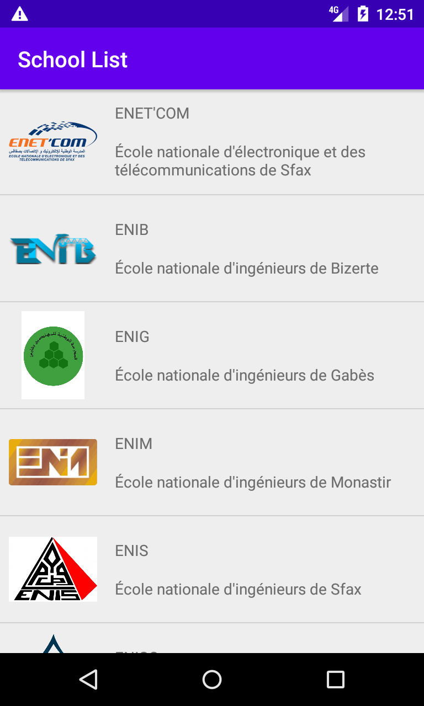

# TD Exercise 3 - Solution

## Aperçu

"**`School List`**" est une application Android qui affiche une liste des écoles d'ingénieurs.

## A faire

Maintenant, l'application charge les données à partir d'Internet ([schools_list.json](https://raw.githubusercontent.com/khammami/td-data-2021/main/assets/json/schools_list.json)) et utilise la bibliothèque [Picasso](https://square.github.io/picasso/) pour charger les images.

Mais il y a un problème: quand il n'y a pas de connexion Internet, nous ne pouvons pas charger les données.

Comme solution, nous aimerions conserver les données localement dans une base de données après les avoir chargées depuis Internet.

- Conserver les données dans une base de données à l'aide de [Room](https://developer.android.com/jetpack/androidx/releases/room) à partir d'[Android Jetpack](https://developer.android.com/jetpack)
- L'architecture de application doit suivre le modèle MVVM.
- Utiliser LiveData dans votre application.
